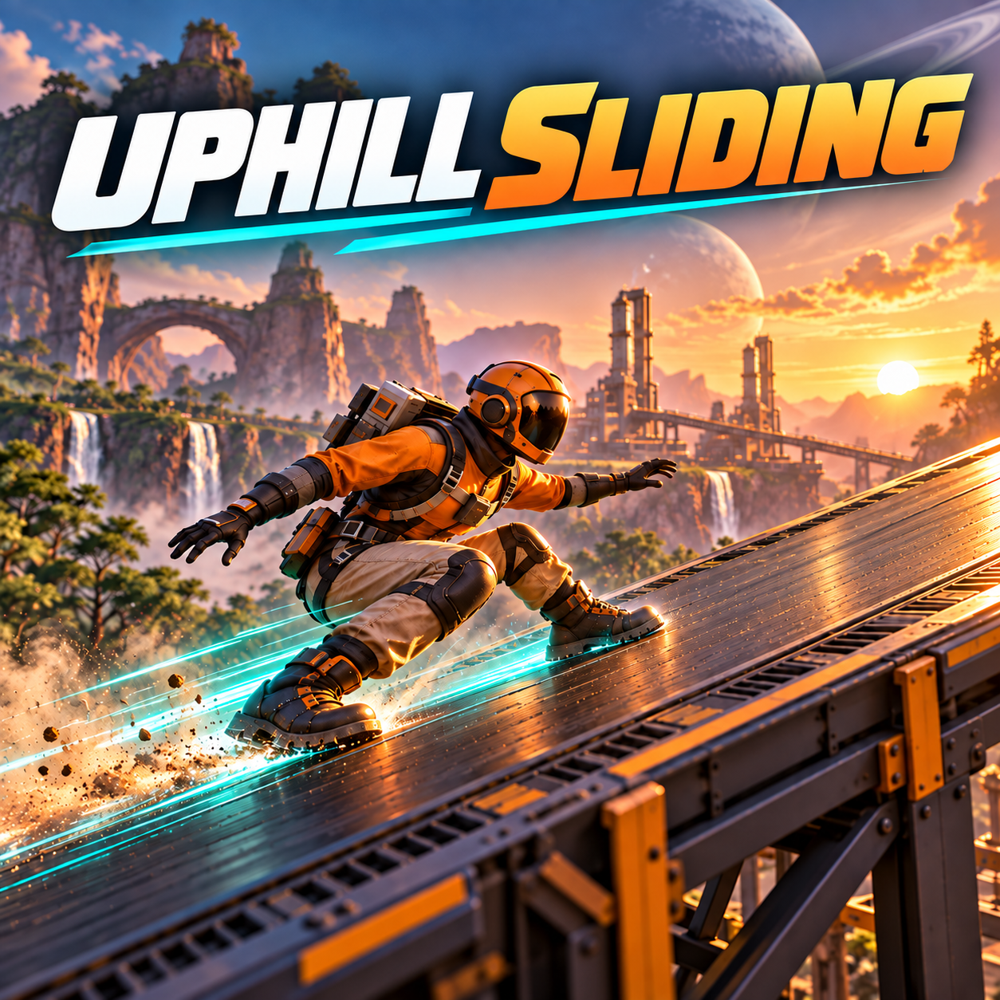

# Uphill Sliding

Keep your speed when the terrain turns uphill.

**Uphill Sliding** lets you continue sliding across uphill slopes in Satisfactory
without abruptly losing your horizontal momentum. Carry the speed you built on
a downhill stretch into the next incline, and keep chaining the game's existing
slide jumps across uneven terrain.

## Features

- Slide uphill on surfaces the game considers walkable.
- Preserve horizontal momentum when an incline would normally slow your slide.
- Keep normal braking: release crouch or apply reverse movement input.
- Use the game's normal crouch and jump controls; no unlocks are required.

The game's existing slide-jump boosts and downhill acceleration stay unchanged.

## Compatibility

- Windows, **singleplayer only**.
- Tested with the Epic Games version of **Satisfactory 1.2.4.0, build 502094**.
- Requires **Satisfactory Mod Loader 3.12.0 or a compatible later 3.x version**.
- Movement changes are inactive in multiplayer and on dedicated servers.

## Source code

This repository contains the mod plugin, including its C++ source and assets.
For development, place it in `Mods/GameFeatures/SlideMomentum` inside a compatible
Satisfactory Modding project using **Unreal Engine 5.6.1-CSS** and matching SML headers.

## Bug reports

[Open an issue](https://github.com/kellykiller/SlideMomentum/issues) with your game
version and a short description of how to reproduce the problem.

---
Created by **Kellykiller** with assistance from OpenAI ChatGPT/Codex for code,
artwork and documentation.
